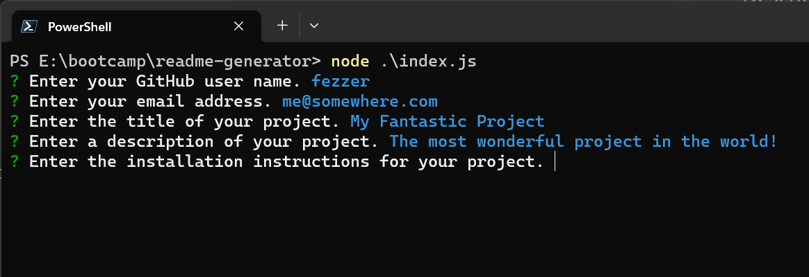

# readme-generator

## Description

This Node.js application will prompt you for various pieces of information about your project and then write a professionally laid out readme.md file.

## Usage

Save the repo files to disc. In your favourite console, navigate to the install directory and run, 
```
node .\index.js
```
Answer the questions to provide the details of your repo. You are not allowed to answer any question with only whitespace characters. 

You can filter the licenses by starting to type your required license name. You can also navigate the list with the arrow keys.

Once the questions are answered a `readme.md` will be written to an `output` subfolder (which will be created if it does not already exist). The readme file will be overwritten on subsequent runs of the app so be sure to rename your readme or save a copy elsewhere.

There is a sample readme included in the repo here, `./samples/README.md`.



A demo of the app can be viewed here, <https://www.youtube.com/watch?v=Ogfr-Te5Hc4>.

## Credits

The question prompts are provided by inquirer, <https://www.npmjs.com/package/inquirer>.

The license autocomplete prompt is provided by inquirer-autocomplete-prompt, <https://www.npmjs.com/package/inquirer-autocomplete-prompt>.

The license badge info is compiled here, <https://gist.github.com/lukas-h/2a5d00690736b4c3a7ba>.

## License

Please see the license in the repo for more details.